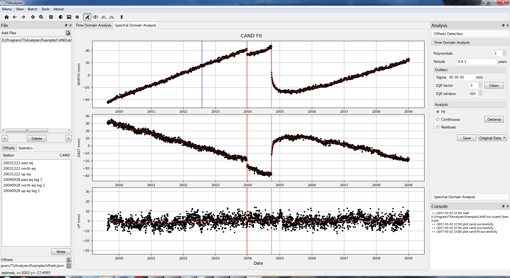
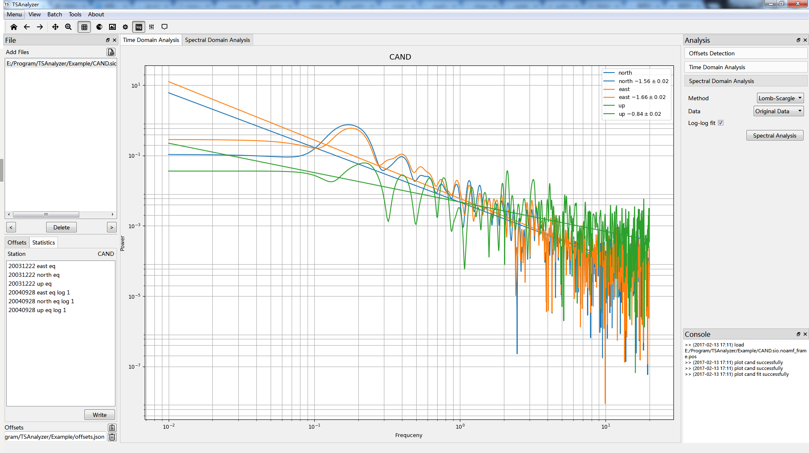

# TSAnalyzer User Manual

[TOC]

## Introduction

Time series analysis is important in any areas such as finical, astronomy, geophysics and so on. In the geophysics, time series are analyzed to extract the signals caused by geophysics phenomenon. This software is designed to analyze the GNSS coordinates time series and estimated the signals, such as linear, periodical signals. Also, some useful tools are provided for analysis convenience.

## Requirements and Installation

TSAnalyzer is based on Python 2.7, so some requirements should be installed before it launched.

### Requirements

- PyQt4
- Matplotlib
- Numpy
- Pandas

### Installation

~~TSAnalyzer is based on Python 2.7, GUI is designed by PyQt4. For scientific use, I recommend WinPython on the windows, which is the leading open data science platform powered by Python and compiles scientific packages already, such as Numpy and Scipy.~~
~~Once you have installed WinPython, the requirements already have also been installed.~~

~~For Windows users, the installation are list as follows:~~

~~1. Download Python 2.7 from the [official website](https://www.python.org/) and Install it;~~
~~2. Download pip tool for packages installation from [pip website](https://pypi.python.org/pypi/pip#downloads) and Install it;~~
~~3. Download Numpy from [Unofficial Windows Binaries for Python Extension Packages](http://www.lfd.uci.edu/~gohlke/pythonlibs/#numpy), then `pip install numpy*.whl` in command prompt;
~~4. Download Pandas from [Unofficial Windows Binaries for Python Extension Packages](http://www.lfd.uci.edu/~gohlke/pythonlibs/#pandas), then `pip install pandas*.whl` in command prompt;~~
~~5. `pip install matplotlib` in command prompt for installing matplotlib;~~
~~6. Download the latest PyQt4 version from PyQt [official sourceforge website](https://sourceforge.net/projects/pyqt/files/PyQt4);~~

~~For Linux users, I would recommend Anaconda which has scientific packages and some requirements except for PyQt4. To install PyQt4, the following commands can be used.~~


Before installing this package, the [Anaconda](https://anaconda.org/) is recommended to be installed. *TSAnalyzer* can support both Python2 and Python3.

- Download this repo,  and `python setup.py install` on common line prompt.
- `pip install tsanalyzer`


After that, the package creates a command `tsanalyzer` in your path. And just type 'TSAnalyzer' on your terminal and it goes!

~~Also, we provide executable software for [win64](https://github.com/wudingcheng/TSAnalyzer/releases).~~

## GUI Instructions

### Time Domain Analysis Instructions



#### Tool Bar (from left to right)

-  Home plot view
-  Previous plot view
-  Next plot view
-  Pan the figure
-  Zoom the figure
-  Toggle figure grid lines
-  Subplot Configuration
-  Save the figure
-  Figure Settings (lines, markers, colors)

The above buttons are common in time domain and spectral domain.  The following tool buttons are designed only for Time Domain Analysis.

1.  Equipment Break
2.  Earthquake Break
3. Earthquake Exponential Relaxation
4.  Earthquake Logarithmic Break
5.  Toggle the error bar

#### Files (Short-cut)

- Add the files button: `ctrl` + `o`
- Read the previous file: `ctrl`+`q`
- Read the next file: `ctrl`+`w`
- Delete the selected file:  `ctrl`+`d`
- Read file: double click the file

#### Offsets and Statistics

- Edit offset item: double click
- Write Button: write offsets into file
- Open Offsets Button : load the offset file
- Delete Offsets Button : delete the offset file

#### Analysis Area

- Polynomials: Integer, 0-10, **0 means search for the best orders**.
- Periods: Float, **space** between each other
- Outliers sigma: filter the sigma larger than given threshold, **space** between each component
- IQR Factor: Integer, **0** means do not do IQR method
- IQR Window: Integer, the sliding window

### Spectrum Domain Analysis Instructions



#### Tool Bar

-  Log button, toggle the figure between linear and log-log axis
-  Highlight Button
-  Annotation Button

#### Analysis Area

- Method, current support Lomb-Scargle only
- Data, analysis the specific data
- Log-log fit
- Spectral Analysis, do analysis

### Header Comment Tool


**TSAnalyzer** supports *pos, tseries, cats neu* formats currently.
For more flexible formats, Header Tool Comment is provided for add comment header to original time series files.

Header Comment Tool is in the menu tools. By using this tool, you can set your files head comments and can be understood by TSAnalyzer. Suppose that you have many other format time series files, you can use this tool to add comment and avoid doing any conversion. The hands-on tutorial will show a detail introduction.

### Date Conversion Tool


In the GNSS coordinate time series analysis, there are some formats of time are given, so TSAnalyzer provides this tool for convenience.

## Analysis Instructions, a Hands-on Tutorial

### Header Tool Comment

From the Header Comment Tool Figure, there are some parameters should be input.

- Unit, mm abbreviation for millimeter, although the original file’s unit is meter

- Scale, we use scale factor 1000 to convert meter to millimeter.

- Time Unit, years and days supports at present.

- Column indexes andcolumn names, starting from **0** in this example, we use columns year [(1)](undefined), doy (2), north (3), east (4), up (5), north_sigma
  (6), east_sigma (7) and up_sigma (8).

  Index columns supports the following key words: year, month, day, hour, minute, seconds, doy, ymd, hms, mjd

  1. doy, day of year
  2. ymd, year month day,for example 2010101
  3. hms, hour minute seconds, for example 120000
  4. mjd, Modified Julian Date

- Directory, save new files after adding header comments.

After adding header comments, we could use TSAnalyzer to load these new files.

### Time Series Anlysis Step by step

#### 0. Load File

Click the add file(s) button , and choose the time series file(s); the file list widget will display their names.

#### 1. Read file

Double click the filename to load the file. TSAnalyzer will plot time series files component(s) separately.

#### 2. Pick the offsets


It is not obvious to see offsets because of the outliers’ existence. Some outliers have very large uncertainties. Hence we could set sigma criterion to filter theme. In the outlier group, set the IQR factor to 0, and do the remove outliers.


From the figure, we could see there existed two offsets. We use break and log break to pick them out. Zoom and pan has been provided on the toolbar to pick accurately.

In the figure, we could see the red rectangle, it records these offsets. You can double click these items to edit accurately from the popup dialog. After you have pick these offsets, click the write button on the left bottom corner to save these offsets for later use.

Another tool for detection offsets we provided is [Sigseg](http://www.ing.unitn.it/~vittia/sw/doc/sig_seg_doc.html), we compile the Sigseg source code to dynamic library, and load them with `ctypes`. As the program is beta version, user should check the Menu >> Tools >> Offsets Detection (Beta).

The result of the detection depends on the values of the parameters. We also provide interactive tools for choose the results:

1. click the red `+` symbol on the plot to delete;
2. Double click the list widget or click the delete button to delete the selected items;


After check the results of sigseg, click **Add button**, the results will be add to the main program.


#### 3. Remove the outliers


In the step 2, we adopt sigma criterion to remove some gross errors. There still some outliers displayed on the plot. So IQR method can be used. IQR factor and IQR window can be input according to your data. Here we select factor 3 and window 365 (a year).

#### 4. Time Series Analysis

In the step 3, IQR method adopt the paraments polynomials and periods.

Polynomial order can be set from 0 to 10, 0 stands for searching the best polynomial order.

Period not fixed to one, space between each other, and the unit in this data is year, this means we input semi-annual and annual periods.


If the “Fit” is checked, it plots the fit line on the clean plot, “Continuous” stands for removing any offsets, “Residuals” means plotting residual time series. Click the detrend button to do analysis.

The result will be showed in the popup dialog. If you are boring with popup dialog, in the **Menu View** to uncheck the **show detrend log** button and the result will be should in the **Console Area**.


#### 5. Save the Data

The original data means the input data, if you do some outliers action, then the data is the clean data. The fit data is the red fit line data and the residuals is the difference the original data between fit data.

### Spectral Series Analysis Step by Step

Spectral domain analysis is useful for time series analysis. For GNSS coordinates time series, it is common for gap and discontinuities’ existence. So Lomb-Scagle method is used very often.


Click the spectral analysis button, the result will be plotted. In the toolbar, there are some tools for better visualization. Log-log axis, highlight lines and annotation tools.

### Batch Operation

Because of the growing number of GNSS stations, many organizations will process the hundreds or thousands of GNSS time series. TSAnalyzer provide tools for batch analysis, including detrend and plot.
In the menu batch, there are **detrend** and **plot** batch menus.

#### Detrend Batch


The batch dialog has a similar operation as the previous time domain analysis’. The parameters are the same, except for some directories and time interval (the right panel).

1. Outlier Save Dir, in which the data will be saved after remove the outliers

2. Outlier Data Name Suffix, the name of the clean data saved, taking KMTR.tseries for example, the clean data will be saved in `D:\Program\TSanalyzer\Example\clean\KMTR_clean.neu`.

3. Analysis Log Dir, analysis log mentioned in time domain analysis will be saved in this directory.

4. Analysis Save Dir, the original clean data after removing the polynomials, periods and offsets from will be saved in this directory.

5. Analysis Data Name suffix, like the outlier data name suffix

6. Time interval, designed for individual stations flexibly.

   ```
   # # stands for comment
   # The first line if suit for whole time series file
   # space between from start and end time
   # format should be ymd(hms) can be omitted
   20000101 20140101
   # 200001011200 201401011200
   # The following lines should be in the format
   # site omit_start omit_end
   tain 20000101 20140101
   ```

After setting the parameters mentioned, click batch button and it goes!

#### Figure Batch


Also for plot figures easily, TSAnalyzer provides figure batch tool (menu - batch - figure). It has limited customs style at present, including figure format (png, jpg, eps, pdf) figure dpi, and error bar plotting or not. If you set the offsets file, it will plot the offsets events on the figure. Click the batch button and it goes!

## Mathematic Model

### Least Squares Analysis

$$
y(t_i) = a+ \sum_{i=1}^{n}b_i(t_i-t_0)^i + \sum_{i=1}^{n_p}(c_i \sin (2\pi t_i / p_i) + d_i \cos(2 \pi t_i / p_i)) + \sum_{i=1}^{n_g}(g_i H(t_i - T_{g_j})) + \sum_{i=1}^{n_l}(C_{l_i} + l_i H\ln (1 + \frac{t_i - t_{eq}}{\tau})) + \sum_{i=1}^{n_e}(C_{e_i} + e_i H (1-e^{(-1(t-t_{eq_i}/\tau))})) +v_i
$$

`* if the math equations cannot be rendered, please refer to the pdf file`

In the equation, $b_i$ is polynomials, if $i=1$ for $b_i$, it is the linear trend, $c_i$ and $d_i$ are harmonic components, the $H$ is a step function and $g_i$ can be used to explain the sudden change event caused the equipments or co-seismic, $C_{l_{i}}$ and $C_{e_{i}}$ terms are stand for logarithmic or exponential function to be fit after an Earthquake. These terms are the accumulated post-seismic motion, C is the co-seismic offset, and τ is the decay time.

This model can be used to estimated polynomials (max order is 10, if zero is selected, it can search for best order), harmonics (users can define the period) as well as step function (including sudden change, post-seismic log or relaxation) at specific times (users pick interactively or input offsets file), detail information is displayed in the picture.

### Outliers

#### Big Sigma Criterion

This criterion is according the sigma (userinput, accepted one or three numbers) to mask out the data whose sigma islarger than sigma criterion to get the cleaner data. One number input meansthat three sigma criterion for all components are the same. If you want tospecific for individual component, please use space between numbers.

Apart from this, we also use 3 times standard deviations criterion here. Equation is:
$$
\bar{v} - 3 v_{std} \leq v \leq \bar{v} + 3v_{std}
$$
if sigma is not set, this criterion will not be adopted.

#### IQR

By using the least squares model, one could get the residuals $v$, then the software use the window (user input) to get the percentile of 75%, median and 25%.
$$
| \mathbf{v}_i - \mathbf{v}_{median}| > factor (\mathbf{v}_{75} - \mathbf{v}_{25})
$$

### Spectrum Analysis

Spectral analysis method is based on Lomb Scargle, the source code comes from Astrop. For datail information, the instructions can be found on http://docs.astropy.org/en/stable/stats/lombscargle.html.

## Reference

- Astropy. http://www.astropython.org/
- Goudarzi, M. A. and M. Cocard, et al. (2013). "GPS interactive time series analysis software." GPS Solutions 17 (4): 595-603
- Herring, T. (2003). "MATLAB Tools for viewing GPS velocities and time series." GPS Solutions 7 (3): 194-199
- Matplotlib. http://matplotlib.org/
- Nikolaidis (2002). Observation of geodetic and seismic deformation.
- Numpy. http://numpy.org/
- Pandas. http://pandas.pydata.org/
- Peak Detection. http://nbviewer.ipython.org/github/demotu/BMC/blob/master/notebooks/DetectPeaks.ipynb
- PyQt4. https://www.riverbankcomputing.com/
- Sigseg. http://www.ing.unitn.it/~vittia/sw/doc/sig_seg_doc.html
- Scipy. http://scipy.org/
- Tian, Y. (2011). "iGPS: IDL tool package for GPS position time series analysis." GPS Solutions 15 (3): 299-303
- Zechmeister, M. and M. Kürster (2009). "The generalised Lomb-Scargle periodogram." Astronomy and Astrophysics 496 (2): 577-584.